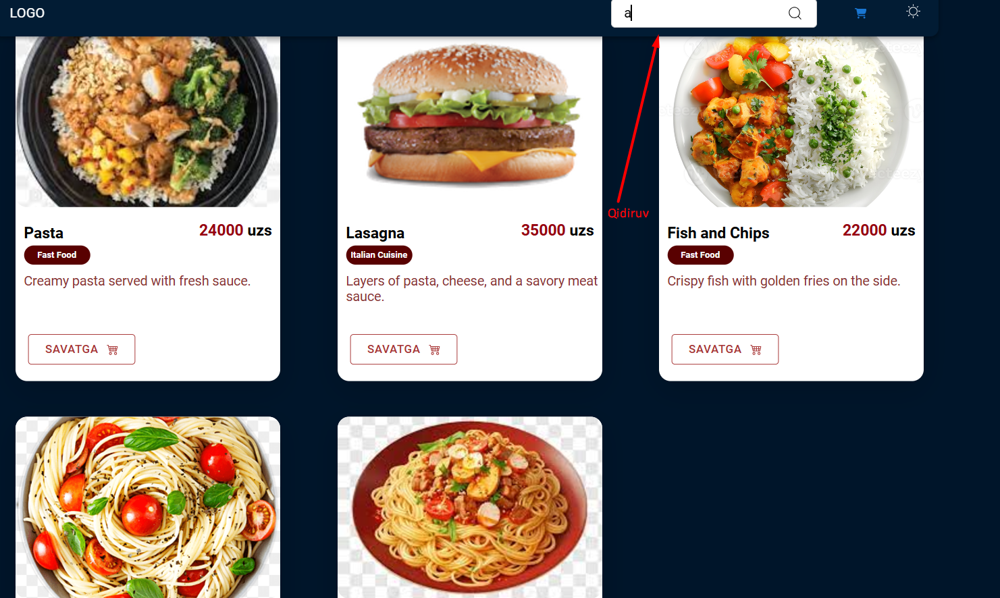

## Loyihani O'rnatish

Loyihani o'rnatish uchun quyidagi qadamlarni bajaring:

1. **Repositoriyeni klonlash:**
   ```bash
   git clone https://github.com/user/repository-name.git
Kerakli paketlarni o'rnatish:


cd food-deliveir,
npm install,
Loyihani ishga tushirish:
npm run dev,
Brauzerda loyihani ko'rish uchun: http://localhost:5173

Ishlatilgan Texnologiyalar
Loyihada quyidagi texnologiyalar ishlatilgan:

Frontend:
React
TypeScript
Material UI
React Query
Zustand
Axios
API Documentation
GET /product
Bu endpoint barcha mahsulotlarni olish uchun ishlatiladi. Response quyidagicha bo'ladi:

=
[
   {
        "id": 1,
        "name": "Cheese Burger",
        "price": "55000",
        "category": "Fast Food",
        "image": "https://encrypted-tbn0.gstatic.com/images?q=tbn:ANd9GcT1k6uuN7ezJwvc1fQ2amqXsPnallnsKrnL4g&s",
        "description": "A classic cheese burger with fresh ingredients."
    }
]
GET /category
Bu endpoint mavjud kategoriya turlarini qaytaradi. Response quyidagicha bo'ladi:

j
["Fast Food","Italian Cuisine","Vegetarian"]
POST /order
Bu endpoint yangi buyurtma yaratadi. Body parametrlari:

json
Копировать код
{
    "id": 2,
    "address": "asdasd",
    "phone": "54646546",
    "paymentType": "card",
    "comment": "sadad",
    "items": [
      {
        "productId": 10,
        "quantity": 7
      },
      {
        "productId": 1,
        "quantity": 11
      }
    ]
}

## Screenshot


## Screenshotlar

### 1. Rasm 1


### 2. Rasm 2
.png)

### 3. Rasm 3
.png)

### 4. Rasm 4
.png)

### 5. Rasm 5
.png)

### 6. Rasm 6
.png)

### 7. Rasm 7
.png)

### 8. Rasm 8
.png)

### 9. Rasm 9
.png)

### 10. Rasm 10
.png)


